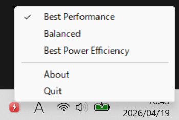

# powermode-tray

A tiny system tray utility to switch Windows 11 power modes (Balanced / Best Performance / Best Power Efficiency) from the system tray.




## Features

- 🔋 Switch between **Balanced**, **Best Performance**, and **Best Power Efficiency** modes from the system tray
- ✅ Check mark indicates the currently active power mode
- 🎨 Tray icon updates to reflect the current power mode
- 💤 Detects Windows Energy Saver state and disables manual mode switching while it is active
- ⚡ Uses undocumented `powrprof.dll` APIs directly — no `powercfg` subprocess spawning
- 🪶 Minimal memory footprint — no GUI framework, pure Win32 API
- 📦 Single small executable (< 300KB) with zero runtime dependencies

## Installation

### Download

Download the latest `powermode-tray.exe` from the [Releases](https://github.com/simosako/powermode-tray/releases) page.

### Build from source

#### Build on Windows 11

**Prerequisites:**
- [Rust](https://rustup.rs/) toolchain (`stable-x86_64-pc-windows-msvc`)
- [Visual Studio Build Tools](https://visualstudio.microsoft.com/visual-cpp-build-tools/) (or Visual Studio) with the **"Desktop development with C++"** workload
  - This also installs the required Windows SDK

```bash
cargo build --release
```

The binary will be at `target/release/powermode-tray.exe`.

> **⚠️ Important:** Always use the **MSVC target**. The GNU target (`x86_64-pc-windows-gnu`) causes link errors due to the combination of `panic = "abort"` and llvm-mingw. Do **not** use `--target x86_64-pc-windows-gnu`.

#### Cross-compile from Linux

If you need Linux-to-Windows cross compilation, use [cargo-xwin](https://github.com/rust-cross/cargo-xwin):

```bash
cargo xwin build --target x86_64-pc-windows-msvc --release
```

The binary will be at `target/x86_64-pc-windows-msvc/release/powermode-tray.exe`.

## Usage

1. Run `powermode-tray.exe`
2. A tray icon appears in the system tray (notification area)
3. Right-click the icon to switch power modes, open the About dialog, or quit

When Windows Energy Saver is active, the menu shows `Energy saver active` and disables manual power mode switching until it is turned off.

### Auto-start with Windows

To launch automatically at login, place a shortcut to `powermode-tray.exe` in:

```
%APPDATA%\Microsoft\Windows\Start Menu\Programs\Startup
```

## How it works

Windows 11 power modes are controlled through **power overlay schemes** — undocumented GUIDs managed by `powrprof.dll`. This tool dynamically loads the following APIs at runtime via `LoadLibraryW` / `GetProcAddress`:

| API | Purpose |
|-----|---------|
| `PowerGetEffectiveOverlayScheme` | Get the currently active overlay (preferred) |
| `PowerGetActualOverlayScheme` | Fallback for getting the current overlay |
| `PowerSetActiveOverlayScheme` | Set the active power overlay |

### Power mode GUIDs

| Mode | GUID |
|------|------|
| Balanced | `00000000-0000-0000-0000-000000000000` |
| Best Performance | `ded574b5-45a0-4f42-8737-46345c09c238` |
| Best Power Efficiency | `961cc777-2547-4f9d-8174-7d86181b8a7a` |

## Architecture

| File | Role |
|------|------|
| `src/main.rs` | Entry point, window procedure, message loop, `debug_log!` macro |
| `src/tray.rs` | Hidden window creation, tray icon add/remove |
| `src/menu.rs` | Right-click context menu construction and display |
| `src/power.rs` | Power mode get/set via `powrprof.dll` dynamic loading |
| `src/util.rs` | UTF-16 string conversion helpers for Win32 API calls |

## Debug build

Debug builds output timestamped logs to `%LOCALAPPDATA%\powermode-tray\powermode-tray.log`. Release builds have all logging code completely removed at compile time (zero cost).

```bash
# Debug build (with logging)
cargo build

# Release build (no logging, optimized for size)
cargo build --release
```

On Windows, the binaries will be at `target/debug/powermode-tray.exe` and `target/release/powermode-tray.exe`.

## Disclaimer

This software uses **undocumented Windows APIs** that are not officially supported by Microsoft. These APIs may change or be removed in future Windows updates without notice.

Because this software accesses `powrprof.dll`, some security software products, including ones deployed in corporate environments, may classify it as potentially dangerous software and block it from running.

The author provides this software **"as is"**, without warranty of any kind, express or implied. In no event shall the author be held liable for any damages, data loss, system instability, or other issues arising from the use of this software. **Use at your own risk.**

## License

Licensed under either of

- [Apache License, Version 2.0](LICENSE-APACHE)
- [MIT License](LICENSE-MIT)

at your option.

### Contribution

Unless you explicitly state otherwise, any contribution intentionally submitted for inclusion in this work by you, as defined in the Apache-2.0 license, shall be dual licensed as above, without any additional terms or conditions.
